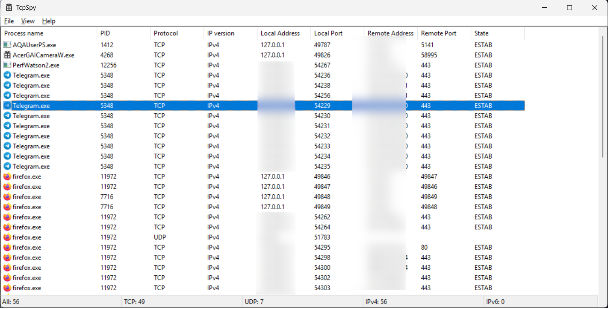
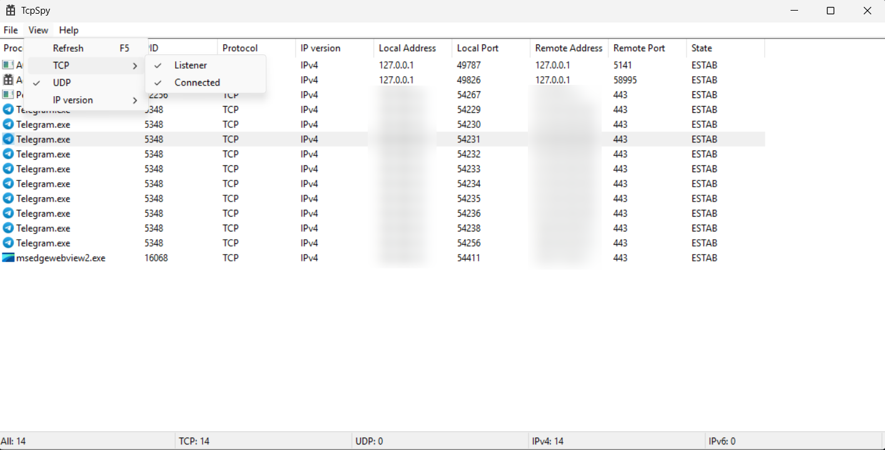
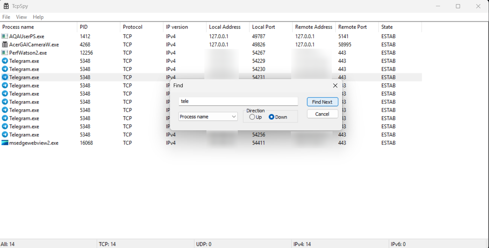

TcpSpy: Tool for monitoring TCP and UDP connections
==========================================

Features
--------
* Filter connections by protocol and family
* Open properties of a running process
* Copy value from list
* Find rows by columns

Compilation
-----------
To compile the program from sources, use Visual Studio 2022. ~~Compiling with mingw in progress.~~

Screenshots
-----------

  

  

  

